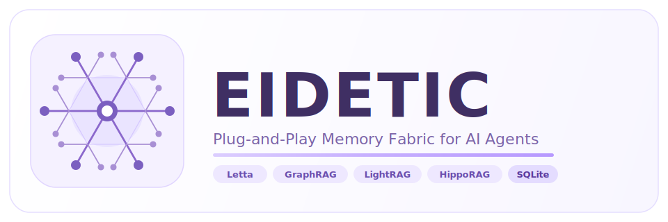

<p align="center">
  
</p>

<h1 align="center">Eidetic</h1>

<p align="center">
  <b>Unified Plug-and-Play Memory Interface for AI Agents</b>
</p>

<p align="center">
  <a href="#"></a>
  <a href="#"></a>
  <a href="#"></a>
  <a href="#"></a>
</p>

---

## Table of Contents

- [Why Eidetic](#why-eidetic)
- [Highlights](#highlights)
- [Persistence Modes](#persistence-modes)
- [Installation](#installation)
- [Quick Start](#quick-start)
- [Architecture](#architecture)
- [Plugin Matrix](#plugin-matrix)
- [Common vs Native Interfaces](#common-vs-native-interfaces)
- [LangChain Integration](#langchain-integration)
- [Examples and Docs](#examples-and-docs)
- [Troubleshooting](#troubleshooting)
- [Testing](#testing)

## Why Eidetic

Agent memory systems, especially the plug-and-play ones, would very likely to be a hot trendency in the future application. Agent memory stacks are fragmented. Different systems expose different APIs, data models, and runtime assumptions. Switching backends means rewriting product logic.

Eidetic provides **one stable, protocol-based interface** so product logic stays portable while memory backends remain fully replaceable underneath.

## Highlights

- **Unified API:** `ingest`, `remember`, `recall`, `forget`, `compact`
- **4 runtime modes:** `mock` → `persistent` → `native` → `auto` (smart fallback)
- **Built-in SQLite backend:** persistent storage with FTS5 full-text search, zero extra dependencies
- **4 native backends:** Letta, Microsoft GraphRAG, LightRAG (HKU), HippoRAG — all fully implemented
- **Lazy loading** via `entry_points` (`eidetic.memory_plugins`)
- **Async-first** design with transparent sync wrapper
- **LangChain adapter** for drop-in memory integration
- **Escape hatch** for backend-specific native capabilities

## Persistence Modes

Every plugin supports four modes, selected via `config["plugin_config"]["mode"]`:

| Mode | Storage | External deps | Use case |
|---|---|---|---|
| `mock` | RAM only | None | Unit tests, rapid prototyping |
| `persistent` | SQLite on disk | None (stdlib) | Dev, single-process production |
| `native` | Backend's own storage | Backend library | Full production with specific backend |
| `auto` *(default)* | Native if installed, else SQLite | Optional | Recommended default |

In `auto` mode, if the backend library is not installed, Eidetic silently falls back to the built-in SQLite backend and emits a `UserWarning` — your code keeps working.

## Installation

Base package (includes built-in SQLite backend):

```bash
pip install eidetic
```

Plugin extras:

```bash
pip install "eidetic[letta]"      # Letta (MemGPT) — requires a running Letta server
pip install "eidetic[graphrag]"   # Microsoft GraphRAG — batch pipeline + graph search
pip install "eidetic[lightrag]"   # LightRAG (HKU) — graph + vector, requires LLM API
pip install "eidetic[hipporag]"   # HippoRAG — hippocampal RAG, install from GitHub
pip install "eidetic[langchain]"  # LangChain memory adapter
```

HippoRAG (no stable PyPI release yet):

```bash
pip install "git+https://github.com/OSU-NLP-Group/HippoRAG.git"
```

Development:

```bash
pip install -e ".[dev]"
```

## Quick Start

### Mock mode (tests, no dependencies)

```python
from eidetic import MemoryManager, Document, MemoryEvent, RecallQuery, ForgetRequest

manager = MemoryManager()
memory = manager.create("letta", config={"plugin_config": {"mode": "mock"}})

memory.ingest([Document(content="Eidetic unifies memory APIs.", tags=["intro"])])
memory.remember(MemoryEvent(content="User prefers concise responses.", role="user", tags=["profile"]))

result = memory.recall(RecallQuery(query="memory APIs", top_k=3))
print([item.content for item in result.items])

memory.forget(ForgetRequest(tags=["profile"], hard_delete=True))
memory.compact()
```

### Persistent mode (SQLite, zero extra deps)

```python
manager = MemoryManager()
memory = manager.create(
    "letta",
    config={"plugin_config": {"mode": "persistent", "db_path": "agent_memory.db"}},
)

# Data persists across process restarts
memory.ingest([Document(content="Project kickoff on 2025-01-10.", tags=["project"])])
result = memory.recall(RecallQuery(query="project kickoff"))
```

### Native mode (real backend)

```python
# Letta — requires a running Letta server (letta server)
memory = manager.create(
    "letta",
    config={
        "plugin_config": {
            "mode": "native",
            "base_url": "http://localhost:8283",
            "agent_name": "my-agent",
        }
    },
)

# LightRAG — requires OpenAI (or Ollama) API key
memory = manager.create(
    "lightrag",
    config={
        "plugin_config": {
            "mode": "native",
            "working_dir": "./lightrag_data",
            "llm_provider": "openai",   # or "ollama", "anthropic", "custom"
            "llm_model": "gpt-4o-mini",
        }
    },
)
```

### Async API

```python
import asyncio
from eidetic import MemoryManager, RecallQuery

async def main():
    manager = MemoryManager()
    memory = await manager.acreate("letta", config={"plugin_config": {"mode": "persistent"}})
    result = await memory.recall(RecallQuery(query="anything"))
    print(result.items)

asyncio.run(main())
```

## Architecture

```text
Application / Agent Framework
            │
            ▼
      MemoryManager
            │
       ┌────┴────┐
       │ Plugin  │  ← lazy-loaded via entry_points
       │Registry │
       └────┬────┘
            │
            ├─── mode="mock"       ── InMemorySemanticBackend (RAM)
            ├─── mode="persistent" ── SqliteBackend (FTS5, WAL, soft-delete)
            │
            ├─── LettaPlugin   ─── LettaBackend       (archival memory, server)
            ├─── GraphRAGPlugin ── GraphRAGBackend     (batch pipeline, graph search)
            ├─── LightRAGPlugin ── LightRAGBackend     (graph + vector, LLM required)
            └─── HippoRAGPlugin ── HippoRAGBackend     (hippocampal RAG, LLM required)
                        │
                        ▼
              AsyncMemoryHandle / MemoryHandle
              (capability checking, error wrapping)
```

## Plugin Matrix

| System | Extra | Persistence | LLM required | Graph-based | Notes |
|---|---|---|---|---|---|
| **SQLite** *(built-in)* | — | ✅ disk (WAL) | ✗ | ✗ | Default fallback, FTS5 search |
| **[Letta](https://github.com/letta-ai/letta)** | `eidetic[letta]` | ✅ server DB | ✗ | ✗ | Requires `letta server` running |
| **[GraphRAG](https://github.com/microsoft/graphrag)** | `eidetic[graphrag]` | ✅ disk index | ✅ | ✅ | Batch indexing; call `build_index()` after ingest |
| **[LightRAG](https://github.com/HKUDS/LightRAG)** | `eidetic[lightrag]` | ✅ `working_dir` | ✅ | ✅ | Recall returns synthesised answer string |
| **[HippoRAG](https://github.com/OSU-NLP-Group/HippoRAG)** | `eidetic[hipporag]` | ✅ `save_dir` | ✅ | ✅ | Reindexes on every `ingest`; use for read-heavy workloads |

### Backend-specific notes

**Letta** stores data in its own SQLite/PostgreSQL database. All five operations are fully supported. `forget` and `compact` list archival memories client-side, so performance degrades at very large scale.

**GraphRAG** is a batch pipeline. After ingesting documents, call the native `build_index()` method to make them searchable. `recall` returns an empty result until the index is built.

```python
# GraphRAG — build index after loading documents
backend = memory.async_handle.backend   # escape hatch
await backend.build_index()             # triggers graphrag index CLI
```

**LightRAG** synthesises a single answer for each `recall` query (it's a RAG, not a retriever). One `MemoryItem` is returned containing the full response. `forget` soft-deletes in a sidecar SQLite file; call `compact()` to rebuild the graph without deleted documents.

**HippoRAG** calls `get_ready()` on the full corpus on every `ingest` / `remember`, which can be slow for large collections. Best suited for workloads where you ingest once and recall many times.

## Common vs Native Interfaces

**Recommended default — use the unified API:**

```python
memory.ingest(...)
memory.remember(...)
memory.recall(...)
memory.forget(...)
memory.compact()
```

This keeps your code portable. Swap backends by changing the `system=` argument.

**Advanced — access backend-specific features:**

```python
native_backend = memory.async_handle.backend

# GraphRAG: trigger indexing
await native_backend.build_index()

# LightRAG: rebuild graph after deletes
await native_backend.rebuild_index()
```

Accessing the native backend increases coupling to one specific backend but unlocks capabilities the unified API cannot express.

## LangChain Integration

```python
from eidetic.integrations.langchain import EideticLangChainMemory

# Uses persistent SQLite by default when letta is not installed
memory = EideticLangChainMemory(
    system="letta",
    config={"plugin_config": {"mode": "persistent", "db_path": "chat.db"}},
    input_key="input",
    memory_key="history",
    session_tag="session-42",
    top_k=5,
)
```

The adapter works with both `BaseMemory`-based LangChain versions and newer plain-class patterns.

## Examples and Docs

- Chinese package guide: [docs/SHOWCASE_ZH.md](docs/SHOWCASE_ZH.md)
- Notebook (common vs specific interfaces):
  [examples/notebooks/common_vs_specific_interfaces.ipynb](examples/notebooks/common_vs_specific_interfaces.ipynb)
- CLI trial script:
  [examples/try_eidetic.py](examples/try_eidetic.py)

## Troubleshooting

| Error | Cause | Fix |
|---|---|---|
| `DependencyMissingError` | Backend library not installed | Follow the `install_hint` in the error message |
| `PluginNotFoundError` | Typo in `system=` name | Check `manager.list_systems()` for valid names |
| `RuntimeError: Cannot call ... inside event loop` | Used sync API inside `async` context | Use `await manager.acreate(...)` and `await memory.recall(...)` |
| GraphRAG `recall` returns empty | Index not built yet | Call `await backend.build_index()` after ingesting |
| LightRAG recall returns `None` | Empty query or graph not ready | Ensure documents were ingested before querying |

## Testing

```bash
python -m pytest -q
```

Tests run across all four plugin systems in `mock` mode and cover the full `ingest → remember → recall → forget → compact` lifecycle, error semantics, and the LangChain adapter.
